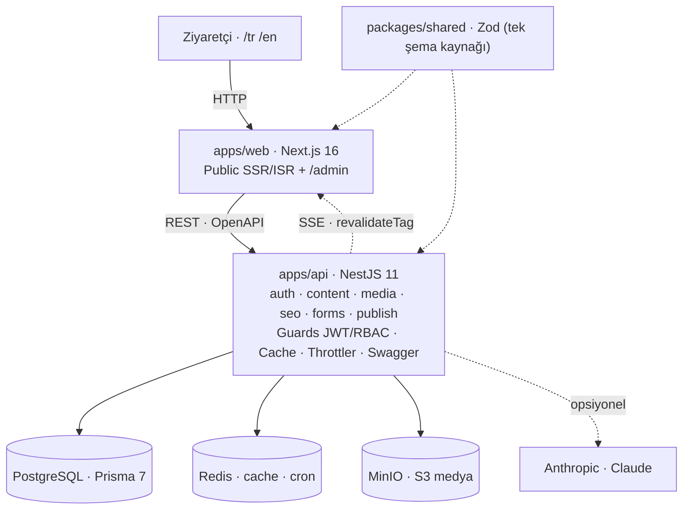

# Kron CMS — krontech.com Yeniden Gelistirme

krontech.com'un tasarimi korunarak; **icerik yonetimi (CMS)**, **SEO/GEO** altyapisi,
**cok dillilik (TR/EN)**, **cache/performans** ve **yayin surecleri** ile birlikte ele alinmis
butuncul bir sistem.

> Bu bir gorsel kopya degil; arkasinda tam bir yonetim sistemi olan bir platformdur.

## Mimari (ozet)

| Parca | Teknoloji | Rol |
|-------|-----------|-----|
| `apps/web` | Next.js 16 + TS (App Router) | Public site + `/admin` paneli; SSR/ISR, cok dilli routing (`/tr`, `/en`) |
| `apps/api` | NestJS 11 + TS | REST API (OpenAPI/Swagger), JWT auth + RBAC, Prisma, Redis cache, S3 upload |
| `packages/shared` | TypeScript | Paylasilan tipler/enum'lar (Role, Locale, PageType, BlockType...) |
| PostgreSQL | 16 | Birincil veri deposu |
| Redis | 7 | Cache + zamanlanmis yayin kuyrugu |
| MinIO | — | S3 uyumlu medya deposu |

Mimari detay: [`docs/architecture.md`](docs/architecture.md) · Kararlar: [`docs/adr/`](docs/adr/)



İçerik modeli + **ER diyagramı**: [`docs/content-model.md`](docs/content-model.md)

## Hizli baslangic (tek komut)

Gereksinim: **Docker** + **Docker Compose**.

```bash
cp .env.example .env
docker compose up --build
```

| Servis | Adres |
|--------|-------|
| Web (public + admin) | http://localhost:3000 |
| API | http://localhost:4000 |
| Swagger (API dokumantasyonu) | http://localhost:4000/docs |
| MinIO konsolu | http://localhost:9001 |

## Yerel gelistirme (Docker'siz uygulamalar)

```bash
npm install
docker compose up postgres redis minio -d   # sadece altyapi
npm run dev                                  # api + web birlikte
```

## Teknoloji kararlari (ozet)

| Konu | Karar | Neden |
|------|-------|-------|
| Backend | **NestJS** | Uctan uca TS, modulerlik, Swagger/guard/pipe first-class |
| API | **REST + OpenAPI** | Swagger gereksinimi, cache/rate-limit basit |
| Auth | **JWT access+refresh + RBAC** | Stateless, olceklenebilir |
| Test | **Vitest + Supertest** | Hiz, ESM, tek arac |

Tam gerekceler: [`docs/adr/0001-tech-stack.md`](docs/adr/0001-tech-stack.md)

## Dokumantasyon haritasi

| Belge | Icerik |
|-------|--------|
| [`docs/site-analysis.md`](docs/site-analysis.md) | Sayfa/icerik/bilesen envanteri, cok dil, SEO alanlari (Faz 1 analiz) |
| [`docs/content-model.md`](docs/content-model.md) | Icerik modeli + **ER diyagrami** + entity gerekceleri + gereksinim eslemesi |
| [`docs/architecture.md`](docs/architecture.md) | Sistem mimarisi (diyagram) + istek yasam dongusu + cache katmanlari |
| [`docs/comparison.md`](docs/comparison.md) | krontech.com vs rebuild — tasarim pariti + canli performans olcumu |
| [`docs/adr/`](docs/adr/) | Mimari karar kayitlari (teknoloji, icerik modeli, auth) |
| [`docs/deployment.md`](docs/deployment.md) | Uretim imaj stratejisi, olcekleme, logging/monitoring |
| [`docs/demo-senaryosu.md`](docs/demo-senaryosu.md) | ~12 dk canli demo akisi + olasi sorular |
| [`docs/decision-log.md`](docs/decision-log.md) | Her gelistirme turunun karar gunlugu (AI katkisi dahil) |

## Dizin yapisi

```
.
├── apps/
│   ├── api/        # NestJS REST API
│   └── web/        # Next.js (public site + admin)
├── packages/
│   └── shared/     # Paylasilan TypeScript tipleri
├── docs/
│   ├── adr/        # Mimari karar kayitlari
│   └── architecture.md
├── docker-compose.yml
└── .env.example
```

## Komutlar

| Komut | Aciklama |
|-------|----------|
| `npm run dev` | api + web birlikte (yerel) |
| `npm run build` | Tum uygulamalari derle |
| `npm run test` | Tum testler |
| `npm run lint` | Lint |
| `docker compose up --build` | Tum sistem (tek komut) |

## Durum

Tum ana fazlar tamam: icerik modeli + headless API, **admin panel** (icerik CRUD + blok siralama + medya + SEO + formlar),
**yayin akisi** (taslak/onay/yayin/zamanlanmis/onizleme/versiyon+restore/audit), **SEO/GEO**
(meta/canonical/hreflang/sitemap/robots/301 + OG image + schema.org JSON-LD/FAQPage), **cok dillilik** (TR/EN),
**Redis cache + publish'te `revalidateTag`**, **formlar** (client+sunucu validasyon + KVKK + honeypot + CSV export),
**next/image** (otomatik WebP/AVIF + lazy + CLS korumasi), **mobil navigasyon**,
ve **testler** (Vitest + Supertest; birim + entegrasyon, 29 test). Karsilastirma analizi: [`docs/comparison.md`](docs/comparison.md).

## Gelismis ozellikler

| Ozellik | Nerede | Ne yapar |
|---------|--------|----------|
| 🎨 **Gorsel Duzenleme Modu** | Editor → "Gorsel Duzenle" | Webflow-tarzi: solda gercek bilesenlerle canli onizleme, bloga tikla → formu sagda, ANINDA yansir; undo/redo (Ctrl+Z), masaustu/mobil gorunum |
| 🧱 **Blok Galerisi** | Editor → "+ Blok ekle" | 16 blok tipi: kullanici-dostu ad + aciklama + CANLI render'li hazir tasarim ornekleri |
| ⚡ **Canli Senkron (SSE)** | Onizleme sayfalari + editor | Icerik degisince acik onizleme/editor sekmeleri kendini tazeler (Figma hissi) |
| ⏪ **Zaman Tuneli + Diff** | Editor → "Zaman Tuneli" | Surum gecmisi (kim/ne zaman), gorsel surum onizleme, tek tik restore, iki surum arasi git-tarzi karsilastirma |
| ⌨️ **Komut Paleti** | `Ctrl+K` | Tum icerik/form/medya + aksiyonlarda fuzzy arama |
| ✨ **AI Site Mimari** | Admin → "AI Mimar" | Dogal dil → taslak sayfa; her blok Zod semasindan gecer. `ANTHROPIC_API_KEY` yoksa sablon modu |
| 🩺 **Saglik Denetimi** | Editor yan paneli | Kural tabanli SEO/erisilebilirlik/UX/GEO denetimi (10 kural) |
| ✅ **Onay Akisi** | Durum secimi | EDITOR yayinlayamaz → REVIEW'a gonderir; ADMIN onaylar (sunucuda zorlanir) |
| 🕸️ **Iliski Grafigi** | Admin → Ctrl+K → "Grafigi" | Sayfalar/linkler/ceviriler gorsel harita; yetim sayfa tespiti |

## Girisler

| Rol | E-posta | Parola | Yetki |
|-----|---------|--------|-------|
| ADMIN | `admin@kron.local` | `Admin123!` | Her sey + yayinlama/onay |
| EDITOR | `editor@kron.local` | `Editor123!` | Icerik duzenler, yayinlayamaz (onaya gonderir) |

Admin panel: http://localhost:3000/admin

## Opsiyonel: AI Site Mimari icin Claude

`.env` dosyasina ekleyin (yoksa ozellik sablon moduyla calisir):

```bash
ANTHROPIC_API_KEY=sk-ant-...
AI_MODEL=claude-opus-4-8   # varsayilan
```

Sonra: `docker compose up -d api`
