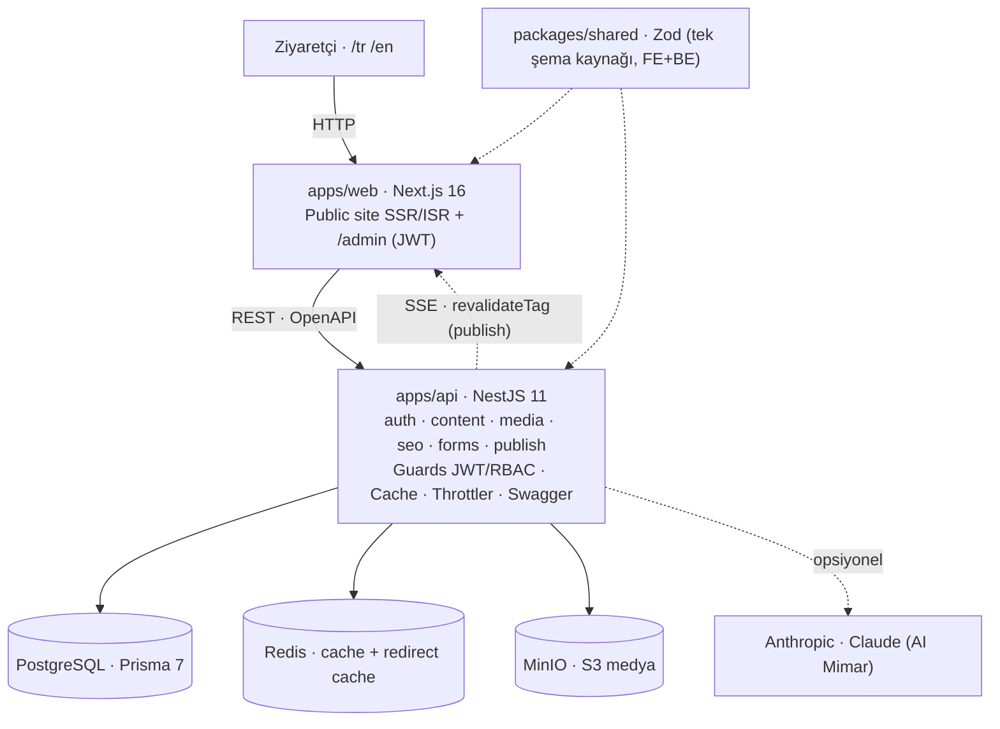

# Mimari — Kron CMS

> Tum fazlar tamamlandi; bu belge guncel mimariyi ozetler.
> Kararlarin gerekceleri: [`adr/0001-tech-stack.md`](adr/0001-tech-stack.md).

## 1. Genel bakis

Kron CMS, krontech.com'u **headless CMS** modeliyle yeniden kurar: icerik (sayfa,
bilesen, blog, urun, medya, SEO) tek bir backend'de yonetilir; public site bu icerigi
API'den okuyup **SSR/ISR** ile render eder. Yonetim, ayni Next.js uygulamasi icindeki
korumali `/admin` alanindan yapilir.

## 2. Bilesenler

| Bilesen | Sorumluluk |
|---------|-----------|
| **apps/web** | Public site (6 sayfa tipi) + admin paneli. SSR/ISR, i18n routing, SEO/GEO ciktilari, Next/Image. |
| **apps/api** | REST API; icerik/medya/SEO/form/yayin is mantigi, auth, cache, rate limit, Swagger. |
| **packages/shared** | Frontend+backend ortak TypeScript tipleri + **Zod blok semalari** (tek kaynak). |
| **PostgreSQL** | Birincil, iliskisel veri deposu (icerik modeli). |
| **Redis** | Uygulama cache'i + redirect cache. Zamanlanmis yayin **@nestjs/schedule** cron ile; refresh token'lar DB'de hash'li tutulur. |
| **MinIO** | S3 uyumlu obje deposu (medya kutuphanesi). |

## 3. Istek yasam dongusu (ozet)

- **Public sayfa:** Next.js sunucu tarafi, `API_INTERNAL_URL` uzerinden API'yi cagirir
  (docker network ici). Sayfa **ISR** ile cache'lenir; icerik publish edilince API,
  Next'in revalidate webhook'unu tetikler (Faz 7).
- **Admin islemi:** Tarayicidaki `/admin`, JWT (httpOnly cookie) ile API'ye yazar; API
  Guard'larla rol kontrolu yapar, degisiklikleri audit log'a yazar (Faz 3).

## 4. Cok dillilik

`/tr` ve `/en` segment-bazli routing (**kutuphanesiz**: `[locale]` segment + `proxy.ts` +
`dictionaries/`). Icerik modelinde her kayit bir **locale** ile iliskili; ceviriler bir
**translation group** uzerinden eslesir (hreflang ve "dile gore icerik" icin).

## 5. Cache katmanlari (Faz 7'de detay)

1. **CDN** (statik varliklar, public sayfalar) — uretimde.
2. **Next.js ISR** — sayfa duzeyinde, publish'te invalidation.
3. **Redis** — API yanit/sorgu cache'i, etiket-bazli temizleme.

## 6. Yerel gelistirme & deployment

- **Tek komut:** `docker compose up --build` → postgres + redis + minio + api + web.
- **Imaj:** Tek monorepo imaji (`Dockerfile`), servisler farkli komutla calisir.
- **Uretim (oneri):** api ve web icin ayri multi-stage imajlar (`next start`,
  `node dist/main`), yatay olcekleme (stateless API), managed Postgres/Redis/S3. (Faz 9)

## 7. Olcekleme, loglama, monitoring (Faz 9'da detay)

- API stateless → yatay olceklenir; oturum durumu Redis'te degil JWT'de.
- Yapilandirilmis (JSON) loglama, request-id correlation; saglik ucu `/api/health`.
- Metrikler ve hata izleme uretimde (orn. OpenTelemetry/Sentry) — oneri olarak belgelenecek.
