# Karsilastirma — krontech.com vs Rebuild

> Sunum artefakti. Amac: (1) **tasarim parity**'sini element element kanitlamak ve
> (2) iki sistemin **mimarisini** karsilastirip rebuild'in degerini netlestirmek.
> Iliskili: [`site-analysis.md`](site-analysis.md) (icerik modeli recon'u),
> [`decision-log.md`](decision-log.md) (karar gerekceleri), [`architecture.md`](architecture.md).

## 0. Yontem ve kapsam uyarisi (ONEMLI)

Recon **istemci taraflidir**: yalnizca tarayicidan gozlemlenebilen sey olcumlenir —
HTML/CSS/JS, 3rd-party scriptler, asset listesi, istek sayisi/boyutu, CMS parmak izi.

- **Gozlemlenen (observed):** frontend yigini, ucuncu-parti katman, CDN, fontlar, gorsel
  agirligi, URL/yol semasi → bunlar dogrudan kanit (network log + `style.css`).
- **Cikarsanan (inferred):** "ozel, sunucu-render CMS" → yalnizca yol semasindan
  (`enjekte.*.js`, `/_upload/...`) cikarim.
- **Gorunmeyen (invisible):** backend dili, veritabani, API tasarimi, kimlik dogrulama,
  cache/invalidation, yayin/taslak akisi, admin paneli. **Disaridan olculemez.**

> Tez: **Bizim rebuild'de sahiplendigimiz katman, tam da krontech'te disaridan
> gorunmeyen katmandir.** Bu yuzden bu bir "gorsel klon" degil; tasarimi referans alan,
> altinda tam bir sistem olan bir yeniden insadir (odev: "gorsel klon degil, butuncul sistem").

Olcum kaynagi: krontech.com ana sayfa (2026-06), 145 HTTP islemi, document 120 KB.

---

## 1. Tasarim parity checklist

Durum: ✅ Eslesti · 🟡 Kismi · ⬜ Bekliyor. Kanit = krontech'ten **cikarilan gercek CSS**
(`style.css`) + bizim **dosya:bilesen** referansi (+ asagidaki gorsel kanit).

| Alan | krontech (gercek deger) | Bizim implementasyon | Durum |
|------|--------------------------|----------------------|:----:|
| Palet (primary) | `#1563ff` | `--color-primary` `globals.css` | ✅ |
| Tipografi | Roboto; body **14px**; `.display-3` 4.5rem/300 | Roboto (300–700) `layout.tsx`; `hero-slide.tsx` `text-[4.5rem] font-light` | ✅ |
| Arka plan | body `#f5f6f8` | `globals.css` body | ✅ |
| Container | `.container` 1140px / `.extended-container` 1200px | `Container` `blocks.tsx` (1140/1200) | ✅ |
| Mavi vurgu | `.bgblueb b { background:#1563ff; color:#fff; padding:0 3px }` | `[&_b]:bg-primary [&_b]:text-white [&_b]:px-[3px]` `hero-slide.tsx` | ✅ |
| Butonlar | `.btn` **border-radius:0** + 50px yatay padding | `rounded-none px-[50px]` `hero-slide.tsx` | ✅ |
| Header | duyuru bari + sticky + nav(dropdown) + arama + dil | `site-header.tsx` + `nav.ts` | ✅ |
| Hero | `#main-slider` Swiper; 2 zemin + per-slide **seffaf urun cemberi** (slaytimagesmobil) | `hero-carousel.tsx` **5 slide**, 2 kolon (metin + urun grafigi), per-slide zemin, yuksek | ✅ |
| Urun showcase | "Kron Products" **gorselli** kart slider (productslider) | `PRODUCT_SHOWCASE` → `product-carousel.tsx` (5 gercek urun + gorsel) | ✅ |
| Deger onermesi | "Why Kron?" **iki kolon** (metin + gorsel + outline btn) | `VALUE_PROP` iki kolon + `why-kron.png` | ✅ |
| Istatistik | "6 kita / 35+ / 200+ / 1500+" **ikonlu** | `STATS` + ikon gorselleri | ✅ |
| Vaka calismasi | banka **gorseli** + `bgblueb` 28px baslik | `CASE_STUDY` + `case-bank.png` | ✅ |
| Blog karuseli | "Keep up to Date" badge + **kapak** + tarih | `BLOG_CAROUSEL` + `Entry.coverImage` (Media) | ✅ |
| Footer | `footer{bg #000; pt 50px}` + `.subfooter #0f1010`; 4 kolon; baslik 16px/600; link beyaz/.5 hover `#1563ff` | `site-footer.tsx` + `footer.ts` | ✅ |
| Blog **detay** sayfasi | makale: kapak+meta | `[slug]/page.tsx`: breadcrumb + POST kapak/tarih + article-prose RICH_TEXT | ✅ |
| **Urun detay** sayfasi | `.product-banner` (bg gorseli + `.display-3` + `.lead` + 2 outline btn) → breadcrumb 11px → `#nav-tabs-wrapper` **ikonlu sekmeler** (64px, 14px/500, `#a7a7a8`, aktif: mavi alt cizgi + renkli ikon, pasif ikon `grayscale`) → **donusumlu 50/50 metin+gorsel** bolumler (h3 `bgblueb`, p `.lead`) → PAM: `.blue-bg-slider` **musteri referans slider'i** (gradyan `#1596FF→#1563FF`, pt-100/pb-144, `.slider-logo` 160x60, `bgwhiteb b` beyaz kutu vurgu, yazar 12px/.8) + Sekerbank **video basari hikayesi** | `HERO variant='product'` + `PRODUCT_TABS` + `MEDIA_TEXT` (×3-5, `cta`'li Sekerbank dahil) + `TESTIMONIAL` (`testimonial-slider.tsx`); icerik `scripts/extract-product-pages.py` ile cikarildi, gorseller sharp-optimize (`public/kron/products/`, 35 dosya ~1MB) | ✅ |
| **Blog liste** sayfasi | banner 226px (overlay `.41`, h1 32/600) + breadcrumb 11px + **col-8/col-4**; kart: kapak **411px**, seffaf kart, `blog-terms` (bold tarih + Read More→ 14/600), ayirici `#dedede`/42px; **5 yazi/sayfa + pagination** (`/blog/2`); sticky **Highlights** (150x87 `mix-blend-luminosity`, 14px baslik, `bgblueb` cipli h3) | `blog-list-view.tsx` + `blog/[page]` route; Highlights = `Entry.featured` (admin checkbox + `?featured=true` API) | ✅ |
| Iletisim/demo formu (koyu `footer-top`) | `.footer-top.dark-form`: zemin gorsel + `rgba(0,0,0,.83)` overlay, py 110px, baslik 32/bold; seffaf input h-46; KVKK 12px/.51; btn-block | `footer-contact-form.tsx` (sitewide, `[locale]/layout.tsx`); `footer-contact` FormDefinition + KVKK + honeypot (reCAPTCHA yerine — bkz. Notlar) | ✅ |
| **Kaynaklar** sayfasi | `pages-top-image` 226px gorsel bant (h1 `display-3 invisible`) + breadcrumb 11px + ortali h2/intro + **3 kart** (`carouselContainer`: p-20, golge `0 6px 12px -4px`, gorsel tasmali + **mavi gradyan** `.gradient-img`, **yan kertik** `.notch`, mavi bold h4 link, outline "Discover More") | `resources/page.tsx` + `page-banner.tsx`; `.kron-notch`/`.kron-gradient-img` (globals.css, olculen degerler); icerik krontech'ten birebir (TR = krontech'in kendi yerellestirmesi) | ✅ |
| **Iletisim** sayfasi | 226px banner + breadcrumb + `big-from` form karti (card p-5, input **h-50 / #a7a7a8**; 11 alan: isim/soyisim/e-posta/unvan/**departman select**/sirket/ulke/telefon/**arama-istegi select**/konu/mesaj + KVKK) + `contact-list` **4 ofis** (gorsel + bilgi karti, donusumlu yon, ikonlu satirlar, deger sutunu 230px) | `contact/page.tsx` + `contact-form.tsx` (FormDefinition `contact` 11 alana cikti, sunucu validasyonu E2E dogrulandi); ofis verileri krontech'ten birebir (cf-email decode) | ✅ |

**Onemli ayrim — "tasarim sistemi" parity'si, piksel klonu degil.** Renk, tipografi,
spacing, bilesen anatomisi ve yerlesim birebir esitlenir; icerik/gorseller temsilidir.

### Gorsel kanit

Headless tarayici (gstack/browse, 1440x900) ile cekildi — krontech.com vs
http://localhost:3000/en. Sol: krontech (referans), sag: rebuild.

**Header + Hero** — duyuru bari, tam nav, koyu hero, **mavi-vurgu** basliklar (`bgblueb`), kare buton:

| krontech.com | Rebuild |
|---|---|
| 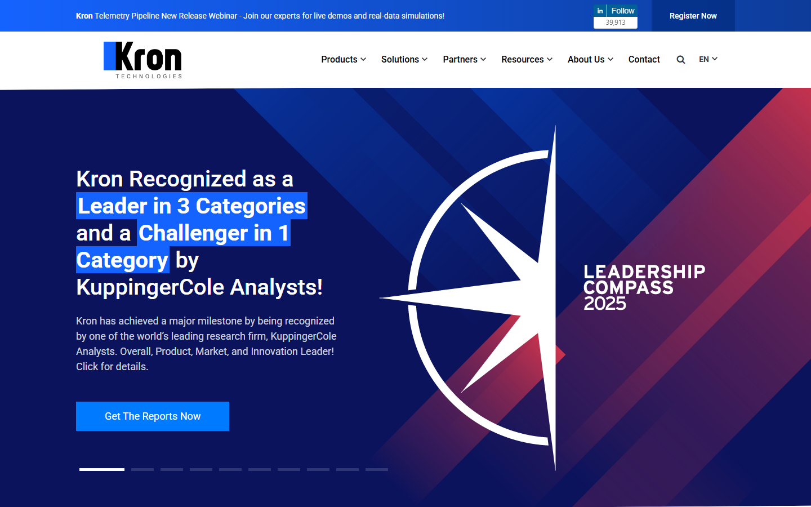 | 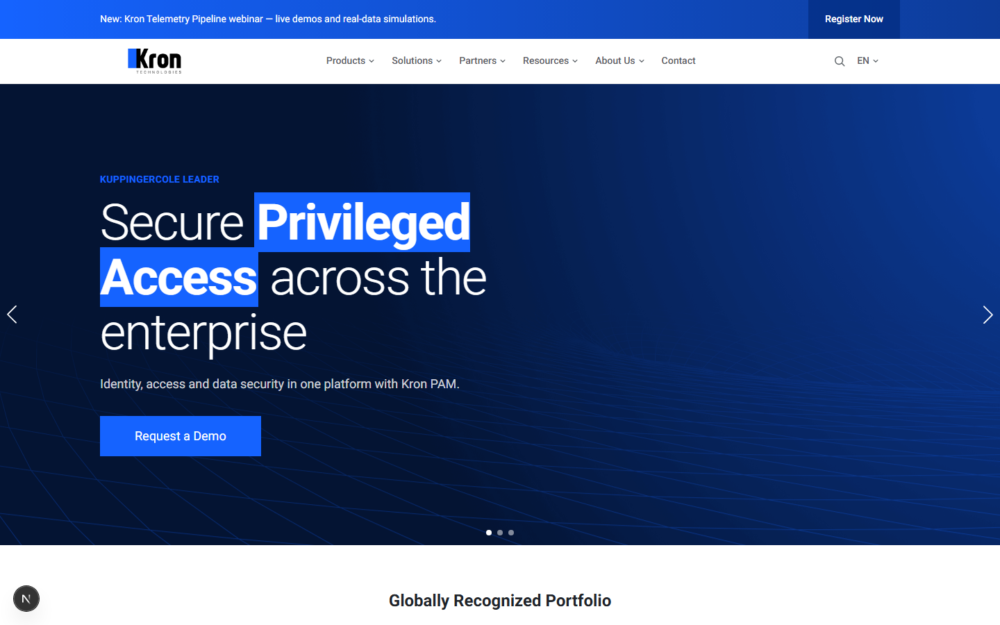 |

**Footer** — `#000` 4-kolon (Products / Sectors / About Us / Social Media) + subfooter yasal linkler:

| krontech.com | Rebuild |
|---|---|
| 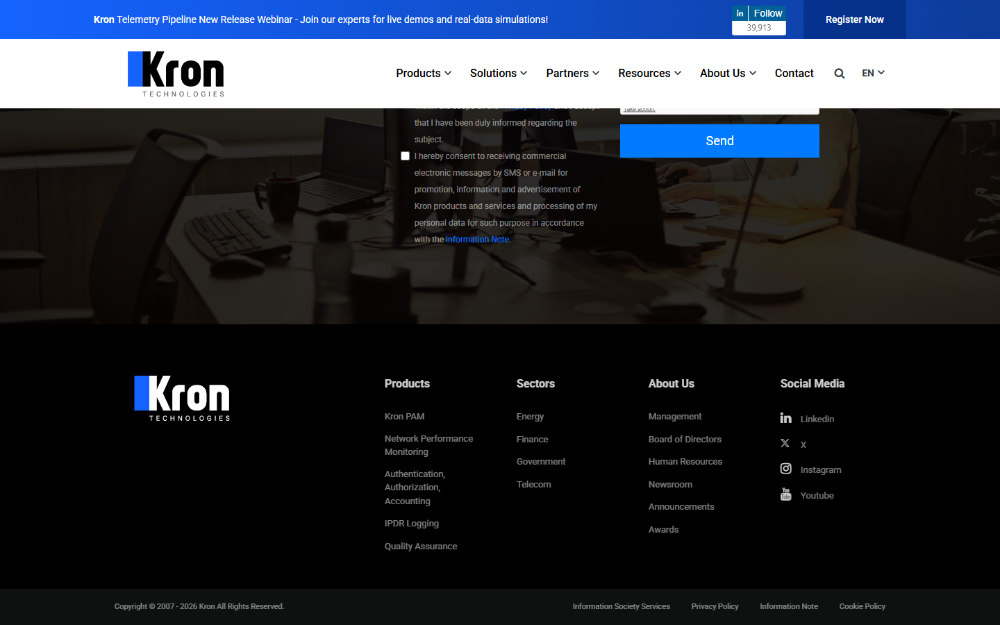 | 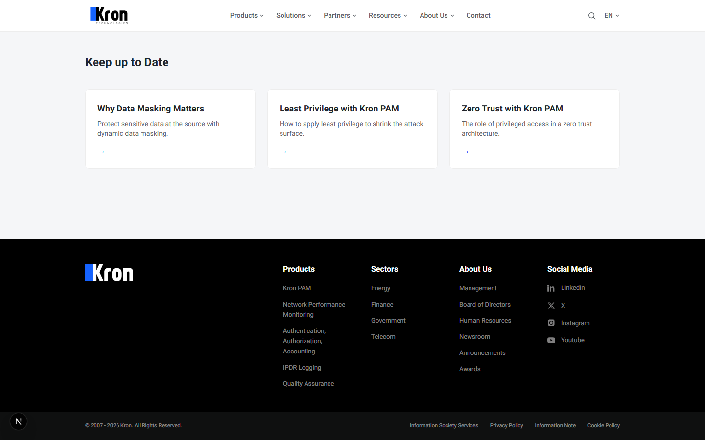 |

**Tam sayfa** — bolum akisi (hero → showcase → why kron → numbers → case study → blog → footer):

| krontech.com | Rebuild |
|---|---|
| 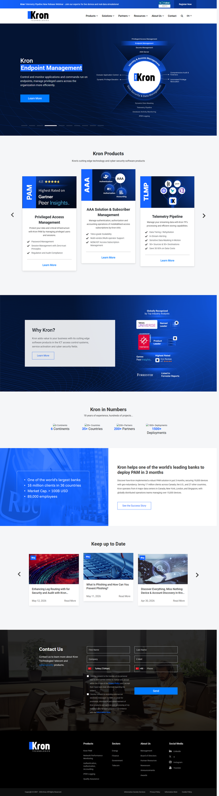 | 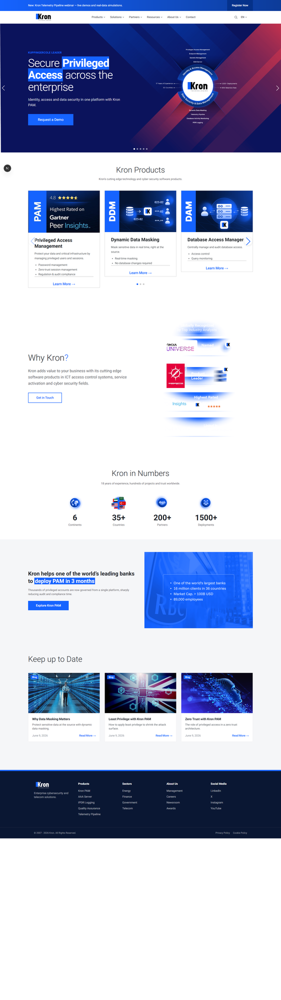 |

**Blog listesi** — banner + breadcrumb + 2 kolon (liste 411px kapaklar + pagination / sticky Highlights) + footer-ustu koyu form:

| krontech.com/tr/blog | Rebuild /tr/blog |
|---|---|
| 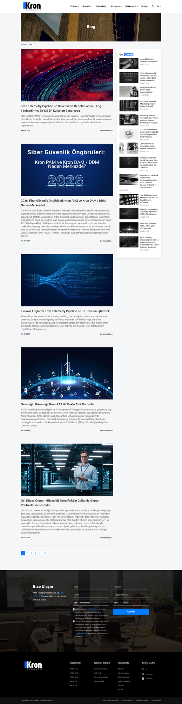 | 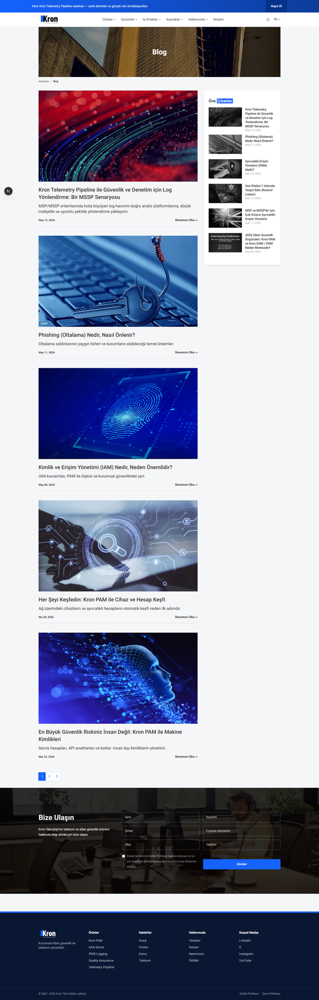 |

**Urun detay (Kron PAM)** — banner + ikonlu sekmeler + donusumlu bolumler + mavi referans slider'i + Sekerbank video hikayesi:

| krontech.com/kron-pam | Rebuild /en/kron-pam |
|---|---|
| 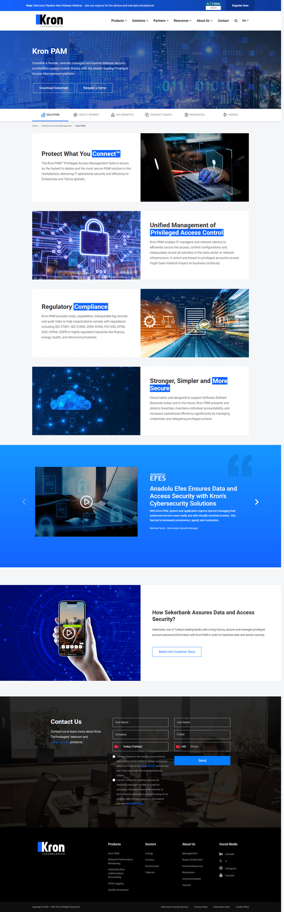 | 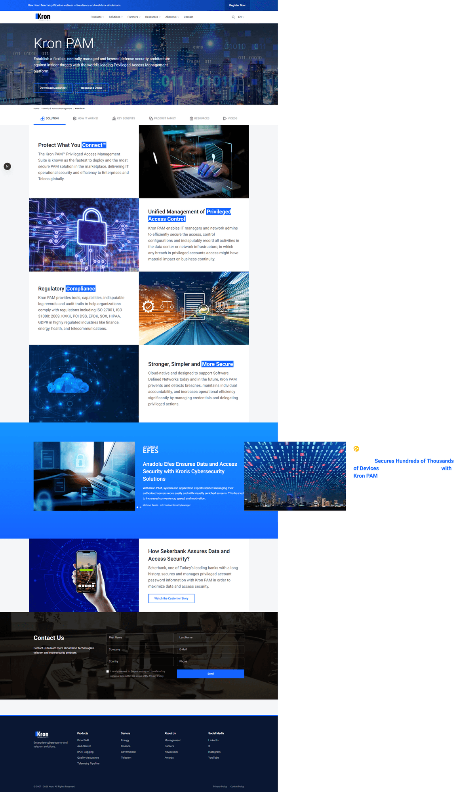 |

**Kaynaklar** — gorsel banner + ortali baslik + 3 gradyanli kart:

| krontech.com/resources | Rebuild /en/resources |
|---|---|
| 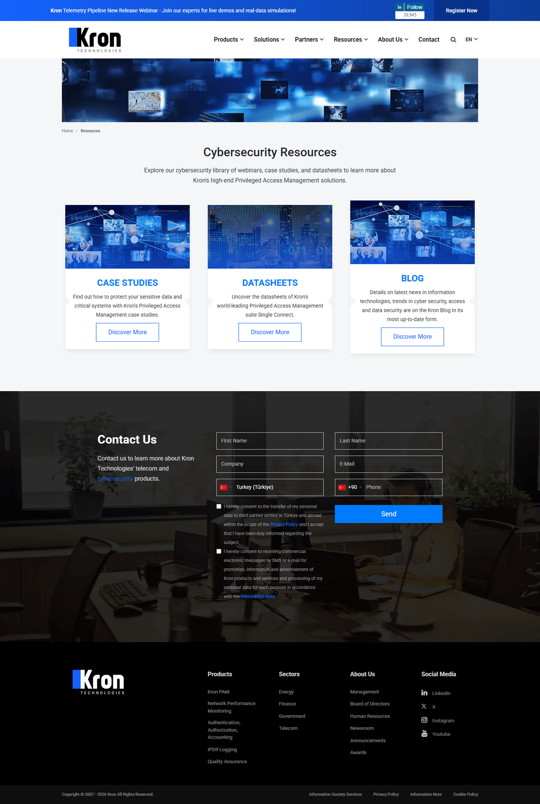 | 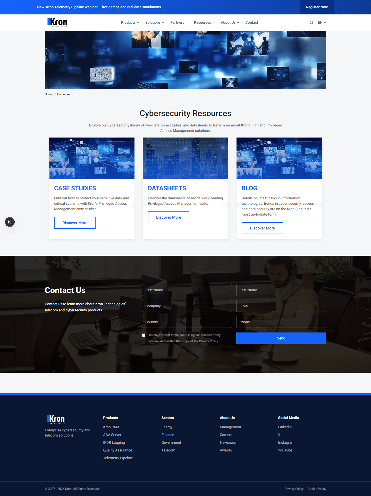 |

**Iletisim** — banner + buyuk form karti + 4 ofis (donusumlu):

| krontech.com/tr/iletisim | Rebuild /tr/contact |
|---|---|
| 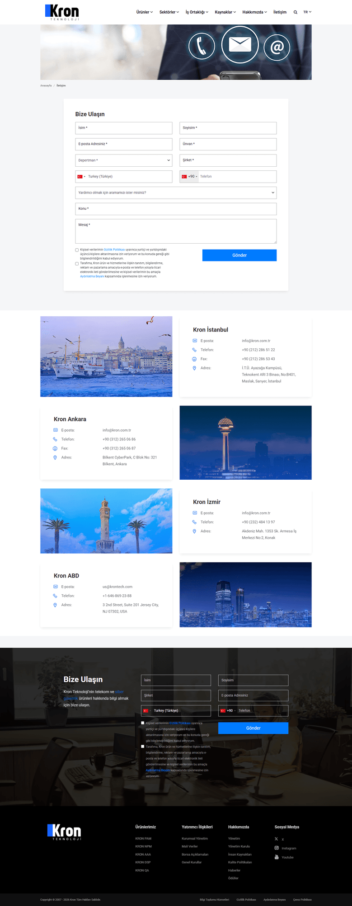 | 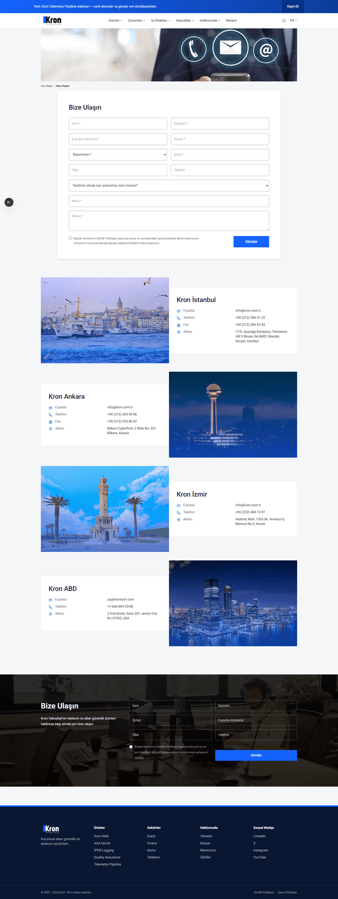 |

> Footer neredeyse **piksel-esit** (ayni kolonlar/linkler/sosyal ikonlar/yasal bar). **Bolum sirasi
> da artik krontech ile ayni** (Hero → Products → Why Kron → Numbers → Case Study → Blog).
> Onceki tek yapisal fark olan footer-ustu koyu **"Contact Us / Bize Ulasin" formu da kapatildi**
> (`footer-contact-form.tsx`, tum sayfalarda). Anasayfa bolumleri ve blog listesi
> **gercek krontech asset'leriyle** birebir esitlendi.

---

## 2. Mimari karsilastirma

| Katman | krontech.com (gozlemlenen / cikarsanan) | Rebuild (bizim — bilinen) |
|--------|------------------------------------------|----------------------------|
| Render | Monolitik **sunucu-render** tek HTML (120 KB) | **Next.js 16** App Router, SSR + ISR, RSC |
| Frontend | jQuery **3.4.1 (+ ikinci jQuery)**, Bootstrap, **Swiper + Owl** (2 carousel), Colorbox+lity (2 lightbox), sweetalert, intlTelInput, maskedinput, sticksy, lazysizes | **React 19 + TypeScript** (no `any`), Tailwind v4, **tek** carousel (swiper/react), tipli blok registry |
| CMS | **ozel "enjekte"** (cikarim: `enjekte.core/project.js`, `/project/_resources/`, `/_upload/{slayt,listcontent,menu,...}images`) | **Headless, API-first**: tek `Entry` (PAGE/PRODUCT/POST) + blok modeli (`type+order+data`) |
| Icerik tipi | Yola gomulu, alan adlari sizan (slayt/listcontent/menu) | `BlockType` enum + **`@kron/shared` Zod semalari** (FE/BE tek kaynak) |
| Backend | **GORUNMEZ** (dil/framework bilinmiyor) | **NestJS** (feature modulleri, guard/pipe, Swagger `/docs`) |
| Veritabani | **GORUNMEZ** | **PostgreSQL + Prisma 7** (migration, tipli) |
| API | **GORUNMEZ** | **REST + Swagger**, rate limit, DTO + class-validator |
| Auth | **GORUNMEZ** (admin paneli disaridan yok) | **JWT** httpOnly cookie + refresh rotation, **RBAC** (ADMIN/EDITOR) |
| Cache | Cloudflare kenar cache (gozlemlenen) | **Redis** uygulama cache + tag invalidation; Next ISR |
| Medya | `/_upload/...` (sunucu fs, cikarim) | **MinIO / S3** uyumlu (yeniden kullanilabilir medya kutuphanesi) |
| i18n | TR `/tr`, EN buyuk olcude oneksiz | Temiz `/tr` + `/en`, native Next i18n + `TranslationGroup` (hreflang) |
| Calistirma | — (gorunmez) | **`docker compose up`** tek komut (postgres/redis/minio/api/web) |
| 3rd-party | **Cok agir** (Bolum 3) | Yok (analitik/izleme opsiyonel, kapsamda degil) |

**Okuma:** krontech satirlarinin yarisi "GORUNMEZ". Bir rakibin frontend'ini kopyalamak
kolaydir; degerli ve degerlendirilen kisim **gorunmeyen sistemdir** (icerik modeli, API,
auth, yayin akisi, cache) — bizim insa ettigimiz tam da bu.

### Yetenek karsilastirmasi — ornekli (admin + gelismis ozellikler)

Yukaridaki tablo *stack*'i karsilastirir; burada **ne yapilabildigi** karsilastirilir.
krontech'in yonetim katmani disaridan **gorunmez** oldugu icin eksen: "biz = kanitli /
krontech = gorunmez ya da yok". Her satirda sunumda **canli gosterilebilecek somut bir
senaryo** var.

#### Odev-gerekli yonetim yetenekleri

| Yetenek | krontech | Rebuild — somut ornek (demoda goster) |
|---------|----------|----------------------------------------|
| Icerik + blok siralama | gorunmez | Ana sayfada "Why Kron?" blogunu yukari tasi → ANINDA onizlemede yansir (`visual-editor.tsx`) |
| Blog & urun yonetimi | gorunmez | `/admin/entries/new` → tip POST → baslik → bloklar → yayinla → `/tr/blog`'da cikar |
| Medya: yukleme + reuse | `/_upload/...` (cikarim) | Bir gorseli bir kez yukle → 3 sayfada `coverImageId` ile yeniden kullan; "URL kopyala" |
| SEO/GEO yonetimi | gorunmez | `/kron-pam`: canonical `https://...`, robots=noindex, OG gorseli → `view-source`'ta meta + JSON-LD; `/sitemap.xml` otomatik guncellenir |
| Yayin sureci | gorunmez | Taslak kaydet → **3 gun sonraya zamanla** (SCHEDULED) → **preview link** ile paydasa goster → yayinla (cron 30sn'de yayinlar) |
| Versiyonlama | gorunmez | Basligi degistir → kaydet → **Zaman Tuneli**'nde v1↔v2 **diff** → v1'e **restore** (ayni surume 2. restore kopya ALMAZ) |
| Redirect (SEO koruma) | gorunmez | `/eski-pam` → **301** → `/tr/kron-pam` (admin'de tanimli, Redis cache) |
| Cok dil eslestirme | TR/EN ayri | TR sayfada "Ceviriler" paneli → "EN cevirisi olustur" → ayni `TranslationGroup` → hreflang otomatik baglanir |
| Form yonetimi | reCAPTCHA + gorunmez | Admin'de "demo" formu tanimla (ad/email/sirket) → sayfaya CONTACT_FORM blogu → gonder → admin'de gor → **CSV indir** |
| Yetkilendirme (RBAC) | gorunmez | `editor@kron.local` ile gir → yayin secenegi YOK → REVIEW'a gonder → admin onaylar (**sunucuda 403 ile zorlanir**) |
| API + dokumantasyon | gorunmez | `http://localhost:4000/docs` Swagger — her ucu dene; **rate limit** aktif |

#### Gelismis ozellikler (odev-ustu; krontech'te YOK)

| Ozellik | Somut ornek (demoda goster) |
|---------|------------------------------|
| 🎨 Gorsel editor | Bloga tikla → basligi degistir → ANINDA yansir → Ctrl+Z; masaustu/mobil gorunum |
| ⏪ Time Machine + Diff | 2 surum sec → yan yana git-tarzi fark → tek tik restore |
| ⚡ SSE canli senkron | Iki sekme: editorde kaydet → onizleme sekmesi KENDINI tazeler (yesil nokta) |
| ✨ AI Mimar | "MFA neden onemli, blog yazisi" → **makale sablonu** (HERO yok, RICH_TEXT agirlikli) + taslak metin → editorde rotusla |
| 🤖 AI asistan | SEO sekmesi → "Oneriler Al" → onerilen meta'yi **Forma Uygula**; Ceviri → TR→EN gercek Claude |
| 🩺 Saglik Denetimi | "Denetle" → **0-100 skor** + kategori cipleri (SEO/Erisilebilirlik/UX/GEO) + gecen kontroller |
| ⌨️ Komut Paleti | Ctrl+K → "kron pam" → Enter |
| 🕸️ Iliski Grafigi | Sayfa/link/ceviri haritasi → **yetim sayfa** (gelen linki olmayan) kirmizi halka |
| ✅ Onay akisi | (yukarida) EDITOR → REVIEW → ADMIN |

**Okuma:** Frontend kopyalanabilir; ama bu yetenek katmani krontech'te disaridan
**gorunmez ya da yok**. Odevin "gorsel klon degil, butuncul sistem" sartinin somut kaniti
tam burasidir.

---

## 3. Performans / agirlik notu

**krontech (gozlemlenen):** ~**145 HTTP istegi**. Agirligin buyuk kismi icerik degil:

- **Ucuncu-parti / izleme:** GTM (457 KB) + birden cok gtag (388/540/380 KB), GA + GA4,
  Google Ads/DoubleClick remarketing (**2 conversion ID**), **Facebook Pixel** (371+230 KB),
  **LinkedIn Insight** (217 KB ×2), OneTrust, **reCAPTCHA `recaptcha__tr.js` 876 KB × 4 frame**,
  Leadfeeder, **ZoomInfo**, ipapi.
- **Optimize edilmemis gorseller:** `GroupZ9.png` **1 MB**, `slider_bg_kc` 635 KB,
  `analysts-back` 459 KB + ~8 mobil slayt PNG'si 160–245 KB. Responsive `srcset`/WebP **yok**.
- **Iki jQuery + iki carousel + iki lightbox** (mukerrer kutuphane).
- Gozle gorulur hatalar: `krontech.com/Array` → **404**, OneTrust `consent//.json` → **404**.

**Rebuild yaklasimi:**

- **SSR + ISR** (`fetch(revalidate, tags)`) + **Redis** → tekrar eden istekte DB'ye gitmez.
- **Tek** carousel kutuphanesi; bilesenler tipli ve gerektiginde yuklenen ("use client" yalniz
  carousel'larda).
- Next/font ile Roboto (yalniz kullanilan agirliklar). **Public gorseller `sharp` ile optimize**
  (display-aware resize + PNG palette / JPG mozjpeg). **Ayni kaynak gorseller, optimize edilmis:**
  `GroupZ9` (banka vaka) 1 MB→**170 KB**, `slider_bg_kc` 635 KB→**124 KB**, ikonlar ~100 KB→**~10 KB**;
  `public/kron` toplam ~3.5 MB→**0.9 MB**. (Yuklenen medya icin S3 pipeline + ileride `next/image`.)
- Pazarlama/izleme **kapsam disi** (eklenirse GTM ile tek noktadan, KVKK/OneTrust ile).

> Adil olalim: ucuncu-parti agirligin cogu **pazarlama kararidir**, muhendislik kusuru
> degil. Ama mukerrer kutuphaneler, optimize edilmemis PNG'ler ve `srcset` eksikligi
> dogrudan iyilestirilebilir teknik borctur — rebuild bunlardan kacinir.

### Canli olcum: ayni arac, ayni makine, ayni ag (2026-06-11)

Headless Chromium (1440x900) ile **ayni metodoloji** iki siteye uygulandi
(Navigation Timing + Resource Timing). Onemli adillik notlari tablonun altinda.

| Metrik (ana sayfa, soguk) | krontech.com | Rebuild `/tr` (DEV modu) |
|---|---:|---:|
| Tam yuklenme (load) | **13.8 s** | **1.6 s** |
| DOM hazir | 12.2 s | 1.0 s |
| HTTP istegi | 103 | 40 |
| — ucuncu-parti istek | 25 | **0** |
| — script sayisi | 34 | 4 |
| Transfer (olculebilen) | ~6.4 MB | ~2.8 MB |

| Metrik (urun sayfasi, sicak cache) | krontech `/kron-pam` | Rebuild `/en/kron-pam` |
|---|---:|---:|
| Tam yuklenme | 1.26 s | 1.21 s |
| HTTP istegi | 101 | 29 |

**Adillik notlari:** (1) Rebuild **DEV modunda** olculdu (minify yok, ~2.8 MB'in cogu
gelistirme JS chunk'lari; prod build belirgin dusurur) — krontech ise prod + Cloudflare.
Buna RAGMEN soguk yuklemede ~9x fark var. (2) krontech transfer rakami muhtemelen
**eksik sayim** (cross-origin kaynaklarda `Timing-Allow-Origin` yoksa transferSize=0
okunur); istek SAYILARI guvenilirdir. (3) Sicak-cache urun sayfasinda krontech makul
hizlanir (Cloudflare + tarayici cache) — fark esas **ilk ziyarette** ve **istek
profilinde** (34'e karsi 4 script; 25'e karsi 0 ucuncu-parti). Rebuild gorselleri artik
`next/image` ile WebP/AVIF olarak servis edilir (dogrulandi: `image/webp`).

### Core Web Vitals — uygulanan teknikler

CWV gercek deger olarak **uretim + RUM** (gercek kullanici olcumu) ister; uretim katmani
kapsamda degil (plan: `deployment.md`'de `web-vitals` → kendi ucumuz). Ama her CWV metrigi
icin **somut teknik** uygulandi:

| Metrik | Risk | Uygulanan teknik (kanit) |
|--------|------|--------------------------|
| **LCP** (en buyuk icerik) | Yavas hero gorseli / font | Hero grafigi `priority` (`hero-slide.tsx`); gorseller `next/image` (WebP/AVIF, dogru boyut); `next/font` Roboto (`display:swap`, yalniz kullanilan agirliklar); SSR/ISR ile hizli ilk byte |
| **CLS** (gorsel kayma) | Boyutsuz gorsel / gec font | Tum `next/image`'da `width/height` veya `fill`+`sizes` → yer rezerve; banner yukseklikleri sabit; font swap |
| **INP** (etkilesim gecikmesi) | Agir client JS | **RSC varsayilan** (blok render'i sunucu tarafi); `"use client"` yalniz carousel/form/editorde; **tek** carousel kutuphanesi; mukerrer kutuphane yok (krontech'te 2 jQuery + 2 carousel) |

> Durustluk: DEV modunda CWV yaniltici (minify yok). Prod build + RUM ile gercek deger
> alinir. Yine de ham yuk olcumu (yukarisi) — soguk **1.6 s**, **4 script** — LCP/INP icin
> saglikli bir zemin oldugunu gosterir.

---

## 4. Sonuc

- **Tasarim:** Header, hero (carousel + tipografi + mavi vurgu), anasayfa bolumleri ve footer
  krontech'in **gercek CSS degerleriyle** birebir; kanit tahmin degil, `style.css` + kod.
- **Mimari:** krontech bir klasik monolitik jQuery/Bootstrap + ozel CMS sitesi; rebuild
  modern, **headless, API-first, tipli, cache'li, container'li** bir sistem.
- **Asil mesaj:** Disaridan gorunen frontend taklit edilebilir; **degerlendirilen katman
  gorunmeyen sistemdir** (icerik modeli, API, auth, yayin, SEO/GEO, performans) — odev de
  tam olarak bunu istiyor ("altyapi dogru kurulmazsa calisma basarisiz sayilir").

---

## 5. Notlar

- **Gorsel kanit cekildi** (Bolum 1) — headless tarayici (gstack/browse) ile, manuel mudahale
  yok; krontech cookie banner'i otomatik temizlendi. Yeniden uretim: `docs/img/comparison/README.md`.
- **Bekleyen parity** (durust): yalnizca krontech'in koyu **footer-ustu inline iletisim formu**
  (bizde ayri `/contact` sayfasi). Anasayfa + urun/blog **detay** parity'si tamam — gercek krontech
  asset'leriyle (productslider gorselleri, banka vaka, Why-Kron, ikonlar, hero zemini, blog kapaklari).
- **Olcum kaynagi:** krontech.com ana sayfa (2026-06), 145 HTTP islemi (network log) + `style.css`.
- **Guvenlik sertlestirme turu** (bug-cercevesiyle, `decision-log.md`): XSS sanitize
  (escape-then-allowlist), CSV formul-enjeksiyon korumasi, guvenlik basliklari (CSP/HSTS/nosniff),
  CORS fail-closed, upload limit + magic-byte, SSE auth, admin **idle timeout** (15 dk). Ilginc:
  krontech'in CSP/HSTS'i vardi (Cloudflare), bizde yoktu — eklendi.
- **AI gercek mod:** `ANTHROPIC_API_KEY` tanimliyken AI Mimar/asistan **gercek Claude (Opus 4.8)**
  ile calisir (anahtarsiz: deterministik fallback). Opus 4.8 **adaptive thinking** gerektirir
  (eski `thinking.enabled` -> 400; tespit edilip duzeltildi).

---

## 6. Sunum rehberi (ornekli)

Odevin **"Sunum"** bolumu uc sey istiyor; her biri icin hazir cumleler ve ornekler. Bu bolum
dogrudan sunumda kullanilabilir.

### 6.1 Canli demo gosterimi
Tam akis: [`demo-senaryosu.md`](demo-senaryosu.md) (~12 dk). Pusula: **her durakta bir
karsilastirma cumlesi** ("krontech'te bu disaridan gorunmez/yok"). Onerilen sira:

1. **`/tr` ana sayfa** — "Tasarim krontech'ten **olculen** CSS degerleriyle birebir; tahmin degil
   introspection. Kanit: Bolum 1 ekran goruntuleri."
2. **Gorsel editor** (Ctrl+K → Gorsel Duzenle) — bloga tikla, basligi degistir, ANINDA yansir,
   Ctrl+Z. "Onizleme uretimle birebir, cunku AYNI React bilesenleri — ayri sablon motoru yok."
3. **Iki sekme + SSE** — editorde kaydet, onizleme sekmesi kendini tazeler. "Figma hissi; WebSocket
   degil **SSE** — tek yonlu yayin yeterli, native reconnect."
4. **Zaman Tuneli** — iki surum sec → diff → restore. "Her kayit snapshot; restore **idempotent**
   — ayni surume ikinci donus kopya almaz."
5. **Saglik Denetimi** — Denetle → 0-100 skor + kategoriler. "Kural-tabanli, **AI'siz**,
   deterministik — bu yuzden test edilebilir (15 birim test)."
6. **Onay akisi** — `editor@kron.local` ile gir, yayin secenegi yok → REVIEW → admin onaylar.
   "Rol **sunucuda 403 ile** zorlanir; UI sadece yansitir."
7. **AI Mimar** — "MFA neden onemli, blog yazisi" → makale sablonu. "Tip-bazli hazir sablon;
   her blok **Zod kapisindan** gecmeden DB'ye giremez."
8. **SEO/GEO kaniti** — `view-source`: canonical/hreflang/OG/**JSON-LD (FAQPage)**; `/sitemap.xml`,
   `/robots.txt`; `/eski-pam` → **301**.
9. **Swagger `/docs`** + `npm test` → **61 test** (api 38 + web 15 + shared 8).

> **Yedek plan:** Canli ortam riski varsa local demo + Bolum 1 ekran goruntuleri. Sunum oncesi
> taze reseed (`demo-senaryosu.md`'de komut) + iki tarayici penceresi hazir.

### 6.2 Mimari ve teknik kararlarin sozlu aktarimi
Her karari **karar + gerekce + trade-off** uclusuyle anlat (degerlendirme kriteri:
"trade-off farkindaligi"):

- **Neden NestJS, Spring degil?** Frontend TS zorunlu → **tek dil**, sema FE+BE paylasimi
  (`@kron/shared`). Spring ikinci dil (Java) + ayri tip dunyasi getirir, paylasilan sema
  avantajini oldururdu.
- **Neden REST, GraphQL degil?** Icerik okuma desenleri basit + HTTP cache/CDN dostu + Swagger
  sarti. Trade-off: over-fetch riski — ama blok modeli zaten sayfa-bazli okunuyor.
- **Neden tek `Entry` tablosu?** krontech'te **flat kok slug** gozlemledik (`/kron-pam`, nesting
  yok) → tek slug cozumleyici. Analiz → karar zinciri: `site-analysis.md`. (Cikarsama degil olcum.)
- **Neden blok + Zod?** Icerik HTML'e gomulu degil, **yapisal ve tipli**; LLM/kullanici verisi
  Zod kapisindan gecmeden DB'ye giremez. Ornek: AI Mimar 8 blok uretti, **hepsi sema-gecerli**,
  0 dustu.
- **Neden SSE, WebSocket degil?** Tek yonlu yayin yeterli; EventSource **native reconnect**;
  HTTP/proxy/CORS dostu. Cift yonlu gerekmedi.
- **Neden httpOnly refresh + idle timeout?** Refresh **httpOnly** → XSS calamaz; access kisa
  omurlu (15 dk); admin icin **15 dk hareketsizlik logout** (yuksek-yetki sertlestirmesi).
- **Cache neden 3 katman?** Redis (API yanit) + Next ISR (publish'te `revalidateTag` → aninda) +
  CDN-hazir. "Publish edince hangi katman etkilenir" sorusunun cevabi: API → web revalidate → ISR.

Detay/kayit: [`adr/`](adr/) (0001 teknoloji, 0002 icerik modeli, 0003 auth) + `decision-log.md`.

### 6.3 AI'in gelistirme surecine katkisi
AI bu projede **arac degil, yontem** — odev: "AI gelistirmenin merkezinde, uretilen ciktilar
degerlendirilip iyilestirilmeli":

- **Olcum-tabanli parite:** Tasarim "goz karari" degil; krontech CSS'i **introspection** ile
  cikarildi (`#1563ff`, body 14px, `.display-3` 4.5rem/300...) ve AI ile uygulandi. Kanit: Bolum 1.
- **Karar gunlugu:** Her gelistirme turu `decision-log.md`'ye **AI katkisi + gerekce** ile islendi
  — surec seffaf.
- **AI urunun ICINDE:** AI Mimar (prompt → tip-bazli sablon), AI asistan (SEO oto-doldur / ceviri /
  okunabilirlik). Hepsi **Zod kapisindan** gecer — "AI'a sema dayatiyoruz".
- **Cikti degerlendirme (en onemlisi):** AI ciktisini korumadan kabul etmedik. Ornekler: (1) AI
  ceviri anahtarsiz modda her kelimeye "(EN)" ekliyordu → fark edildi, gercek Claude'a baglandi +
  sozluk fallback'i yazildi; (2) Opus 4.8'in `thinking.enabled`'i desteklemedigi **API 400'den**
  tespit edildi → adaptive thinking'e gecildi; (3) Saglik Denetimi/analiz bos donuyordu (thinking
  token bogmasi) → ortak saglam `callClaudeJson` ile cozuldu. Yani AI ciktisi **olculdu, hata
  bulundu, iyilestirildi**.
