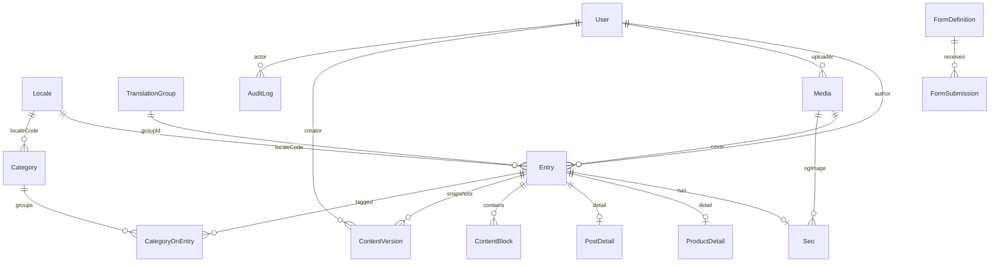

# Icerik Modeli — Kron CMS

> Faz 1 ciktisi. [`site-analysis.md`](site-analysis.md) analizine dayanir.
> Prisma semasi: [`../apps/api/prisma/schema.prisma`](../apps/api/prisma/schema.prisma).

Model uc cekirdek karara dayanir (proje sahibi ile onaylandi):
1. **Tek `Entry` tablosu** (PAGE/PRODUCT/POST) — ortak alanlar tek yerde.
2. **`Locale` + `TranslationGroup`** — entity-per-locale, ceviri eslestirme.
3. **Blok tabanli kompozisyon** (`ContentBlock`: type + order + data) — tipli JSON.

## ER diyagrami

## Cekirdek kararlarin gerekcesi

### 1. Tek `Entry` tablosu (+ 1:1 detay)
Gercek sitede urun/cozum/blog **flat kok slug** ile sunulur. Tek bir
`@@unique([localeCode, slug])` ve tek bir cozumleyici tum tipleri kapsar. Yayin durumu,
SEO, i18n, bloklar ve versiyonlama **tek yerde** yasar — 3 tabloya kopyalanmaz. Tur-ozel
alanlar `ProductDetail` / `PostDetail` 1:1 tablolarinda kalir (normalize + tipli).

### 2. `Locale` (tablo) + `TranslationGroup`
Diller **enum degil tablo** — yeni dil eklemek migration gerektirmez. Her icerik bir
locale'e ait; `TranslationGroup` ayni icerigin dillerini gruplar. Bu sayede: **hreflang**
uretimi, admin'de **icerik eslestirme**, ve bir icerigin yalnizca tek dilde olabilmesi
(kismi ceviri).

### 3. Blok tabanli kompozisyon
`ContentBlock(type, order, enabled, data:JSON)`. Her blok tipinin `data` semasi
`packages/shared` icinde Zod ile tanimlanir → admin'de tipli form, frontend'de tipli
okuma (**no `any`**). Yeni blok tipi = enum + Zod sema + render bileseni (migration yok).

## Entity ozetleri

| Entity | Amac | Kritik alanlar / iliskiler |
|--------|------|----------------------------|
| `User` | Yonetici/editor | `email`, `passwordHash`, `role` (ADMIN/EDITOR) |
| `Locale` | Dil tanimi | `code` (PK), `isDefault`, `enabled` |
| `TranslationGroup` | Ceviri eslestirme | `type`; `entries[]` |
| `Entry` | Tum icerigin govdesi | `type`, `status`, `slug`, `localeCode`, `groupId`, `publishAt`; `blocks`, `seo`, `product`, `post` |
| `ProductDetail` | Urune ozel alanlar | 1:1 `entry`; `tagline`, `features` |
| `PostDetail` | Bloga ozel alanlar | 1:1 `entry`; `readingMin`, `tags[]` |
| `ContentBlock` | Sayfa bileseni | `type`, `order`, `data` (Zod ile dogrulanir) |
| `Seo` | SEO/GEO alanlari | `metaTitle`, `canonicalUrl`, `robotsIndex/Follow`, `og*`, `structuredData` |
| `Category` | Taksonomi | `kind` (PRODUCT/BLOG), `slug`, `localeCode` |
| `Media` | Medya kutuphanesi | `key`, `url`, `mime`, `alt`; id ile yeniden kullanim |
| `Redirect` | URL yonlendirme | `source` (unique), `destination`, `statusCode` |
| `FormDefinition` | Form tanimi | `key`, `fields` (JSON) |
| `FormSubmission` | Form kaydi | `data`, `consent` (KVKK), `status` |
| `ContentVersion` | Versiyonlama | `version`, `snapshot` (anlik goruntu) |
| `AuditLog` | Izlenebilirlik | `action`, `entityType`, `entityId`, `userId` |

## Gereksinim → Entity eslemesi (kapsam)

| Odev gereksinimi | Karsilayan model(ler) |
|------------------|------------------------|
| Sayfa olusturma/duzenleme | `Entry(type=PAGE)` + `ContentBlock` |
| Bilesen ekleme **ve siralama** | `ContentBlock.order` / `type` / `data` |
| Blog & urun yonetimi | `Entry(POST/PRODUCT)` + `PostDetail`/`ProductDetail` |
| Medya yukleme **ve tekrar kullanim** | `Media` (id ile referans) |
| SEO: meta/canonical/index | `Seo` |
| GEO: structured data / FAQ | `Seo.structuredData` + `ContentBlock(type=FAQ)` |
| Redirect yonetimi | `Redirect` |
| Draft/Publish + zamanlanmis | `Entry.status` (+ `SCHEDULED`) + `publishAt` |
| Preview link | imzali token (DB'siz; `PREVIEW_SECRET`) |
| Versiyonlama | `ContentVersion` |
| Audit log | `AuditLog` |
| Cok dil: icerik eslestirme | `Locale` + `TranslationGroup` |
| Form tanimlama/goruntule/export | `FormDefinition` + `FormSubmission` |
| Rol yapisi (admin/editor) | `User.role` |

## Genisletilebilirlik

- **Yeni dil:** `Locale` satiri ekle (migration yok).
- **Yeni blok tipi:** `BlockType` enum + Zod sema + render bileseni.
- **Yeni icerik turu:** `EntryType` + (gerekiyorsa) detay tablosu.
- **Yeni SEO alani:** `Seo` kolonu.

## Butunluk & indeksler

- `@@unique([localeCode, slug])` — flat URL benzersizligi, tek cozumleyici.
- `@@unique([entryId, version])` — versiyon sirasi.
- `@@index([status, publishAt])` — zamanlanmis yayin taramasi.
- `onDelete: Cascade` — `Entry` silinince blok/seo/detay/versiyon birlikte gider;
  `TranslationGroup` silinince grubun entry'leri.
